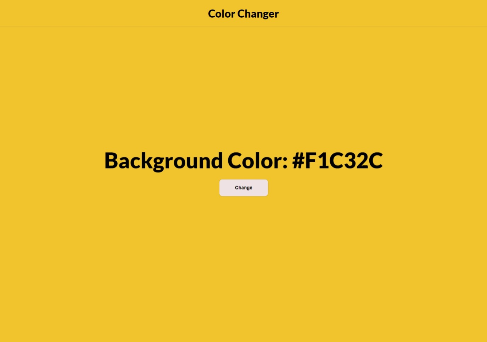
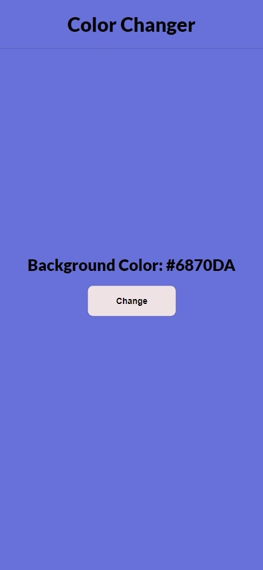

# Background Color Flipper (1/40)
Welcome to the Background Color Flipper project! This project is part of the JavaScript projects series from [freeCodeCamp](https://www.freecodecamp.org/news/javascript-projects-for-beginners/). It's a simple web application that allows you to change the background color by clicking a button.

## Links
- Live Site: [https://rebrodie.github.io/Color-Flipper/](https://rebrodie.github.io/Color-Flipper/).
- Process: []()

## Features
- Click the "Change" button to flip the background color.
- Randomly generates a new background color on each click.
- Simple and intuitive user interface.

## Usage
1. Clone the repository:

   ```bash
   git clone https://github.com/your-username/background-color-flipper.git
2. Navigate to the project directory:

   ```bash
   cd background-color-flipper
3. Open index.html in your web browser.
4. Click the "Change" button to see the background color change.


# Screenshots
## Desktop View

## Mobile View


# Follow Me
- Youtube - [@RebrodieCode](https://www.youtube.com/channel/UCV3pxcx9ALp99txTD6KF3Wg)
- Twitter - [@rebrodiecode](https://twitter.com/rebrodiecode)
